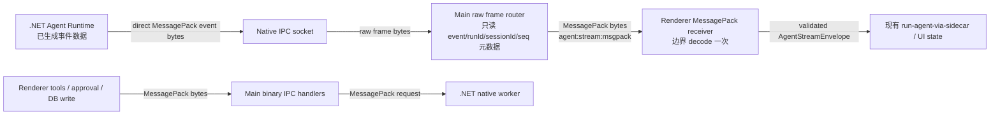

# Native MessagePack End-to-End Transport Plan

## 目标

把 Agent Runtime 已经拿到的数据，在 native worker -> main -> renderer -> 后续高频链路中尽量保持为 MessagePack 二进制传递，减少大上下文、长工具结果、流式 token、图片/工具参数在进程间被反复展开成 JS 对象或 JSON 字节造成的 CPU 与内存占用。

明确边界：

- native worker 解析请求入口可以暂时保留现状：MessagePack frame -> JSON bytes -> `JsonDocument`。
- UI 最终消费时仍然需要 JS 对象，因为 React/Zustand/渲染逻辑不能直接消费 MessagePack bytes。
- 本计划优化的是跨进程和高频数据传输边界，不使用压缩来掩盖问题。
- 迁移完成后，旧的对象 IPC 通道只允许作为短期兼容开关存在，最终应删除。

## 当前链路

```mermaid
flowchart LR
  Renderer["Renderer\nagentBridge.runAgent / chat-store"] -->|Electron IPC object| MainSidecar["Main\nsidecar-manager.ts"]
  MainSidecar -->|@msgpack/msgpack encode| NativeWorkerTs["Main\nnative-worker.ts"]
  NativeWorkerTs -->|MessagePack frame| NativeServer[".NET\nLocalIpcWorkerServer.cs"]
  NativeServer -->|ConvertRequestToJson + JsonDocument| Dispatcher[".NET\nWorkerDispatcher modules"]
  Dispatcher -->|Utf8JsonWriter event| FrameProtocol[".NET\nMessagePackFrameProtocol.EncodeEvent"]
  FrameProtocol -->|JSON bytes -> MessagePack| NativeWorkerTs
  NativeWorkerTs -->|decode full MessagePack to JS object| MainSidecar
  MainSidecar -->|safeSendToWindow object| AgentStream["Renderer\nagent-stream-receiver.ts"]
  AgentStream -->|JS object events| AgentLoop["Renderer\nrun-agent-via-sidecar.ts"]
  AgentLoop -->|object IPC, frequent| DbHandlers["Main\ndb-handlers.ts"]
  DbHandlers -->|object -> native request MessagePack| DbNative[".NET DB module"]
```

当前主要问题：

1. `src/main/lib/native-worker.ts` 在 `handleResponseFrame()` 中对 native 返回的所有 MessagePack payload 做完整 `decode(payload)`。
2. `src/main/ipc/sidecar-manager.ts` 再把 `AgentStreamEnvelope` 作为普通 JS 对象通过 `agent:stream` 发给 renderer。
3. `src/renderer/src/lib/ipc/agent-stream-receiver.ts` 接收的已经是对象，不能避免 Electron structured clone 的对象遍历和复制。
4. native 发送事件时，`sidecars/OpenCowork.Native.Worker/Runtime/MessagePackFrameProtocol.cs` 仍然通过 `WorkerJson.WriteEvent()` 先生成 JSON bytes，再转 MessagePack。
5. 高频 `db:messages:upsert` 目前由 `src/renderer/src/stores/chat-store.ts` 通过对象 IPC 调 main，再由 main 进入 native DB 模块；虽然已有 750ms coalesce，但大消息内容仍会被对象链路处理。

## 目标链路



核心原则：

- native 已经拿到的事件数据，不再先写 JSON 再转 MessagePack。
- main 不完整 decode agent stream 的大 payload，只解析路由所需元数据。
- main -> renderer 使用二进制 MessagePack 通道。
- renderer 只在真正消费边界 decode 一次。
- renderer -> main 的高频反向链路也使用 MessagePack bytes。
- DB 高频写入要同时做二进制传输和降频，不把所有 token 变化都立刻落库。

## 需要新增的模块边界

### shared

新增：

- `src/shared/messagepack/agent-stream-codec.ts`
- `src/shared/messagepack/binary-ipc.ts`

职责：

- 定义 MessagePack 二进制通道的协议版本。
- 暴露 `encodeAgentStreamEnvelope()` / `decodeAgentStreamEnvelope()`。
- 暴露轻量校验函数，校验 `v/runId/sessionId/seq/events`。
- 只放跨进程协议和纯函数，不引入 Electron、React、native worker 依赖。

### native worker runtime

新增：

- `sidecars/OpenCowork.Native.Worker/Runtime/MessagePackWriter.cs`
- `sidecars/OpenCowork.Native.Worker/Runtime/WorkerMessagePackEvent.cs`
- `sidecars/OpenCowork.Native.Worker/Runtime/AgentStreamMessagePackEmitter.cs`

改造：

- `sidecars/OpenCowork.Native.Worker/Runtime/WorkerRequestContext.cs`
- `sidecars/OpenCowork.Native.Worker/Runtime/LocalIpcWorkerServer.cs`
- `sidecars/OpenCowork.Native.Worker/Modules/AgentRuntime/*`

职责：

- 保留现有 `EmitEventAsync(string, Action<Utf8JsonWriter>)` 兼容低频事件。
- 新增高频 agent stream 专用二进制事件 API，例如 `EmitAgentStreamMessagePackAsync(envelope)`。
- 对 `agent/stream` 事件直接写 MessagePack map/array/string/int/bool/null，避免 `Utf8JsonWriter -> JsonDocument -> MessagePack`。
- 在二进制事件外层带上 main 路由所需元数据：`event`, `runId`, `sessionId`, `seq`。

### main

新增：

- `src/main/lib/native-worker-frame-router.ts`
- `src/main/lib/messagepack-route-reader.ts`
- `src/main/ipc/binary-ipc.ts`
- `src/main/ipc/agent-stream-binary-router.ts`

改造：

- `src/main/lib/native-worker.ts`
- `src/main/ipc/sidecar-manager.ts`
- `src/main/window-ipc.ts`

职责：

- `native-worker.ts` 保留 request/response 的普通 decode，但对 `agent/stream` 事件走 raw path。
- `messagepack-route-reader.ts` 只解析 MessagePack 顶层 map 的 `event/runId/sessionId/seq`，不展开 `events` 大数组、不解析工具结果大字符串。
- `sidecar-manager.ts` 根据 raw metadata 找目标窗口，然后发送 `agent:stream:msgpack`。
- `binary-ipc.ts` 优先使用 `webContents.postMessage(channel, arrayBuffer, [arrayBuffer])` 传递 transferable `ArrayBuffer`；不支持时 fallback 到 `webContents.send(channel, Buffer)`。
- 保留旧 `agent:stream` 对象通道作为 feature flag fallback。

### renderer

新增：

- `src/renderer/src/lib/ipc/agent-stream-msgpack-receiver.ts`
- `src/renderer/src/lib/ipc/binary-sidecar-bridge.ts`
- `src/renderer/src/lib/ipc/messagepack-ipc-client.ts`

改造：

- `src/renderer/src/lib/ipc/agent-stream-receiver.ts`
- `src/renderer/src/lib/ipc/agent-bridge.ts`
- `src/renderer/src/lib/ipc/renderer-tool-bridge.ts`
- `src/renderer/src/hooks/use-chat-actions.ts`
- `src/renderer/src/stores/chat-store.ts`

职责：

- 监听 `agent:stream:msgpack`。
- 对收到的 bytes 做一次 `@msgpack/msgpack.decode()`。
- 校验协议版本、seq、runId、sessionId。
- 复用现有 `AgentStreamReceiver.dispatch()` 和 `run-agent-via-sidecar.ts`，避免 UI 层大改。
- approval/tool response/DB upsert 的高频和大 payload 通道使用 MessagePack bytes。

## 分阶段计划

### Phase 0: 基准和协议锁定

目标：先确认优化前指标，并冻结 wire schema，避免边做边改协议。

任务：

1. 建立指标开关：
   - `OPEN_COWORK_MSGPACK_TRACE=1`
   - `OPEN_COWORK_AGENT_STREAM_MSGPACK=1`
   - `OPEN_COWORK_BINARY_DB_IPC=1`
2. 在以下位置打轻量日志：
   - `src/main/lib/native-worker.ts`: frame bytes、是否 raw route、decode 耗时。
   - `src/main/ipc/sidecar-manager.ts`: object channel / msgpack channel 次数。
   - `src/renderer/src/lib/ipc/agent-stream-receiver.ts`: decode 耗时、event 数量、seq gap。
   - `src/renderer/src/stores/chat-store.ts`: upsert reason、coalesce 命中率、flush 次数。
3. 固定 `src/shared/agent-stream-protocol.ts` 作为语义 schema。
4. 新增 MessagePack 协议说明：
   - `v`: 协议版本。
   - `runId`: 路由和订阅。
   - `sessionId`: 窗口路由和状态归属。
   - `seq`: 顺序检查。
   - `events`: 保持现有 event union。

验收：

- 能输出当前 object IPC 和 DB upsert 的频率、payload bytes、平均 decode/clone 相关耗时。
- 不改变现有业务行为。

### Phase 1: native agent stream 直接输出 MessagePack

目标：从 .NET Agent Runtime 已经形成 stream event 后开始，不再经过 JSON bytes。

任务：

1. 新增 `MessagePackWriter.cs`：
   - 支持 map/array/string/binary/int/long/double/bool/null。
   - 使用 `ArrayBufferWriter<byte>` 或可复用 buffer，避免每个事件产生过多临时数组。
   - 将当前 `MessagePackJsonTranscoder` 中可复用的 writer 逻辑拆出或复用，但不要继续要求输入 `JsonElement`。
2. 新增 `AgentStreamMessagePackEmitter.cs`：
   - 负责把 `AgentStreamEnvelope` 写成 MessagePack。
   - 对高频 event 类型提供专用 writer：
     - `text_delta`
     - `thinking_delta`
     - `tool_use_args_delta`
     - `tool_call_result`
     - `message_end`
     - `loop_end`
     - `error`
   - 对低频或暂未覆盖类型可以短期走旧 JSON 兼容，但要被日志标记。
3. 改造 `WorkerRequestContext`：
   - 保留现有 JSON event API。
   - 增加 binary event API。
4. 改造 Agent Runtime 模块：
   - 所有 `agent/stream` 事件优先走 binary emitter。
   - 事件外层必须包含 main 路由元数据，避免 main 完整 decode。

验收：

- `agent/stream` 从 native 写出时不调用 `WorkerJson.WriteEvent()`。
- 大工具结果和长文本 delta 不进入 `JsonDocument.Parse()`。
- `OPEN_COWORK_MSGPACK_TRACE=1` 下可以看到 binary emitter 命中率。

### Phase 2: main 只读路由元数据，不完整 decode agent stream

目标：main 收到 native frame 后不再 `decode(payload)` 展开整个 `AgentStreamEnvelope`。

任务：

1. 在 `src/main/lib/native-worker.ts` 中新增 raw event 分支：
   - `request/response` 仍走当前完整 decode。
   - `agent/stream` 走 raw route。
2. 新增 `messagepack-route-reader.ts`：
   - 读取顶层 map。
   - 只提取 `event`, `runId`, `sessionId`, `seq`。
   - 跳过其他字段时按 MessagePack 类型长度跳过 bytes，不构造 JS 对象。
3. 新增 raw event 回调 API：
   - `onRawEvent(eventName, listener)`
   - listener 入参：`{ event, runId, sessionId, seq, bytes, byteLength }`
4. 保持旧 `onEvent()`：
   - 非 agent stream 仍然 decode。
   - feature flag 关闭时 agent stream 仍可回退旧链路。

验收：

- main 的 `handleResponseFrame()` 对 agent stream 不调用 `@msgpack/msgpack.decode()`。
- main 能根据 runId/sessionId 正确找到目标窗口。
- seq gap、loop_end/error 清理逻辑和旧通道一致。

### Phase 3: main -> renderer 二进制 agent stream IPC

目标：`agent:stream` 对象通道切到 `agent:stream:msgpack` bytes 通道。

任务：

1. 新增 `agent:stream:msgpack` channel。
2. `sidecar-manager.ts` 中：
   - raw event handler 使用 `resolveRendererTargetWindow()`。
   - 发送 MessagePack bytes，不发送 `AgentStreamEnvelope` 对象。
   - `loop_end/error` 的 run cleanup 依赖 raw metadata 或 renderer ack，不完整 decode。
3. `window-ipc.ts` 增加 binary send helper：
   - 优先 `webContents.postMessage()` + transferable `ArrayBuffer`。
   - fallback `webContents.send()` + `Buffer`。
4. 保留短期双发能力：
   - `OPEN_COWORK_AGENT_STREAM_MSGPACK=1`: 只发 binary。
   - `OPEN_COWORK_AGENT_STREAM_DUAL_SEND=1`: binary + object，用于对比。
   - 默认迁移验证后删除 object dual-send。

验收：

- renderer 收到的 `agent:stream:msgpack` 是 `ArrayBuffer`/`Uint8Array`/`Buffer`，不是展开对象。
- Electron IPC payload 不包含大工具结果的 JS object clone。
- 旧 `agent:stream` 可在 feature flag 下回退。

### Phase 4: renderer 入口 decode 一次并复用现有 agent loop

目标：renderer 只在边界 decode，一次性恢复 `AgentStreamEnvelope`，后续 UI 逻辑尽量不变。

任务：

1. 新增 `agent-stream-msgpack-receiver.ts`：
   - 监听 `agent:stream:msgpack`。
   - decode bytes。
   - 校验 `AGENT_STREAM_PROTOCOL_VERSION`。
   - 复用现有 seq gap 检测和 dispatch。
2. 整理 `agent-stream-receiver.ts`：
   - 抽出 `acceptEnvelope(envelope)`。
   - object channel 和 msgpack channel 都调用同一个校验/dispatch。
3. `run-agent-via-sidecar.ts` 不直接关心 wire format。
4. `stream-event-adapter.ts` 保持现有转换。

验收：

- UI 行为与旧链路一致。
- 同一 run 的 event 顺序、loop_end、error 处理一致。
- renderer decode 只发生在 `agent:stream:msgpack` 接收边界。

### Phase 5: reverse channel 迁移为 MessagePack

目标：native 需要 renderer 执行的工具、approval、响应结果，不再用对象 IPC 传大 payload。

涉及通道：

- `sidecar:approval-request`
- `sidecar:approval-response`
- `sidecar:renderer-tool-request`
- `sidecar:renderer-tool-response`

目标通道：

- `sidecar:approval-request:msgpack`
- `sidecar:approval-response:msgpack`
- `sidecar:renderer-tool-request:msgpack`
- `sidecar:renderer-tool-response:msgpack`

任务：

1. main 接到 native reverse request 后，根据 route metadata 找窗口。
2. main 发送 MessagePack bytes 给 renderer。
3. renderer decode request 后执行现有 handler。
4. renderer 把 response/error encode 成 MessagePack bytes 返回 main。
5. main 尽量直接把 response 送回 native request handler；如果 native dispatch 入口暂时仍需要对象，可在 main 单点 decode，后续再下沉。

验收：

- 大工具请求参数和大工具结果不通过 Electron object IPC。
- approval 请求的小 payload 也使用相同通道，保持协议一致。
- 超时、requestId、pending map 清理逻辑与旧通道一致。

### Phase 6: DB 高频 messages upsert 二进制化和降频

目标：解决日志里 `db/messages-upsert` 高频，以及大消息内容在 renderer -> main -> native 路径上的对象 clone 成本。

现状：

- `src/renderer/src/stores/chat-store.ts` 已有 `_pendingMessageUpserts` 和 `MESSAGE_UPSERT_COALESCE_MS = 750`。
- `streaming-final` 和 `strip-reminders` 不 coalesce，会立即写。
- `db:messages:upsert` 通过对象 IPC 到 main。
- main 调 `messagesDao.upsertMessage()`，再进入 native worker request。

任务：

1. 增加 `db:messages:upsert:msgpack`：
   - renderer encode `MessageUpsertPayload`。
   - main binary handler decode 或转发。
   - 先保持 DB schema 不变，`content/meta/usage` 仍按现有 SQLite 字段存储。
2. 增加 `db:messages:add-batch:msgpack`：
   - 批量新消息和最终写入优先使用 batch。
3. 优化 coalesce 策略：
   - streaming checkpoint 从 750ms 提高到更低频的可配置窗口，例如 1500ms 或基于 token/字符增量阈值。
   - `streaming-final` 保持立即写，确保退出或崩溃前最终状态正确。
   - 对同一 messageId 只保留最后一次 pending payload。
   - 当 session 不可见时进一步降低 checkpoint 写入频率。
4. 加强去重：
   - 继续使用 `buildMessagePersistKey()`。
   - 增加 payload byte hash 或 revision hash，避免等价 JSON 字符串重复写。
5. 可选后续：
   - main -> native 增加 packed params API，减少 main decode 后再 encode。
   - native DB 模块直接消费 MessagePack params，但这属于请求解析入口优化，不阻塞本计划第一阶段。

验收：

- `db:messages:upsert` 每 30 秒统计显著下降。
- streaming 时 UI 不依赖每个 token 落库。
- 最终消息、usage、tool result、error 状态不会丢。
- 大消息内容不再通过 renderer -> main object IPC。

### Phase 7: 去掉旧对象通道

目标：验证稳定后删除旧 TS object IPC 兼容路径，避免以后误走慢路径。

任务：

1. 删除或封存：
   - `agent:stream` object 发送路径。
   - renderer object-only agent stream receiver 分支。
   - reverse channel object fallback。
   - DB object upsert fallback。
2. capability 中声明：
   - `agent.stream.msgpack`
   - `sidecar.reverse.msgpack`
   - `db.messages.msgpack`
3. 启动时校验：
   - native worker 支持 MessagePack stream capability 才允许走 native Agent Runtime。
   - capability 不满足时打印明确错误，而不是静默回退到慢路径。

验收：

- 代码搜索不到高频 `agent:stream` object sender。
- 旧路径只剩低频管理通道或完全删除。
- native AOT 启动日志显示已加载二进制 stream 能力。

## 关键实现细节

### MessagePack frame 形态

推荐 native 发给 main 的 agent stream frame：

```ts
type NativeRawAgentStreamFrame = {
  event: 'agent/stream'
  runId: string
  sessionId: string
  seq: number
  v: 1
  events: AgentStreamEvent[]
}
```

原因：

- main 可以只读顶层 `event/runId/sessionId/seq`。
- renderer 收到同一份 bytes 后可以直接 decode 为 `AgentStreamEnvelope` 等价结构。
- 不需要 main 取出嵌套 `params` 再重组，减少一次 copy。

如果需要兼容当前 `{ event, params }` 外层结构，可以短期使用：

```ts
type CompatNativeEventFrame = {
  event: 'agent/stream'
  params: AgentStreamEnvelope
}
```

但长期更推荐扁平 frame，因为 main 路由更轻。

### main 路由解析

`messagepack-route-reader.ts` 只需要实现：

- read map header。
- 读取 string key。
- 当 key 是 `event/runId/sessionId/seq/v` 时读取值。
- 对其他 key 调 `skipValue()`。
- `skipValue()` 必须支持 map、array、str、bin、int、uint、float、bool、nil、ext。

禁止：

- 对 agent stream 调 `decode(payload)`。
- 把 `events` array 展开成 JS 对象再发 renderer。

### Electron binary IPC

优先级：

1. `webContents.postMessage(channel, arrayBuffer, [arrayBuffer])`
2. `webContents.send(channel, Buffer.from(bytes))`

注意：

- `Buffer.subarray()` 可能共享大底层 buffer，发送前要确保传输的 `ArrayBuffer` 只覆盖当前 frame。
- 发送后如果使用 transferable，main 侧不要再访问已 transfer 的 buffer。
- fallback 到 `send(Buffer)` 仍然比对象 IPC 好，因为不会遍历大对象树。

### renderer decode 边界

renderer decode 后进入现有逻辑：


这样 UI 层不用知道传输格式，避免把 MessagePack 细节扩散到组件。

## 风险和处理

| 风险 | 处理 |
| --- | --- |
| main 不 decode 后无法路由窗口 | native frame 顶层必须带 `runId/sessionId/seq`，main 用轻量 reader 读取 |
| Electron binary IPC 仍复制 bytes | 优先 transferable `ArrayBuffer`，fallback `Buffer`；即使复制 bytes，也避免对象树 clone |
| schema 演进导致 renderer decode 失败 | `v` 版本校验，新增字段保持 optional |
| 某些 event 类型 writer 漏字段 | 先 dual-send 对比 object 和 msgpack decode 后的 envelope hash |
| DB 降频导致崩溃时丢最后几百毫秒状态 | `streaming-final` 立即写，窗口关闭/切 session/cancel 时 flush pending |
| 大 base64 图片仍然占内存 | 后续改成 file/url/blob 引用，MessagePack 只传引用，不把 base64 多次复制 |

## 验证清单

### 功能一致性

- 普通聊天能开始、流式输出、结束。
- 工具调用能展示 running/completed/error。
- approval 请求能弹出并正确回传。
- renderer tool request 能执行并返回结果。
- cancel 后 run cleanup 正常。
- sub-agent events 仍能进入事件总线。
- loop_end 后最终 messages 正确落库。

### 顺序和完整性

- `seq` 从 0 或当前约定值连续增长。
- renderer 检测不到 gap。
- `loop_end/error` 后清理 `lastSeqByRun`。
- main 清理 `runWindowIds` 与 `cronDeliveryUsedByRunId`。

### 性能指标

记录优化前后：

- native worker RSS。
- main process RSS。
- renderer RSS。
- main `handleResponseFrame()` 平均耗时和 p95。
- renderer stream decode 平均耗时和 p95。
- 每 30 秒 `db:messages:upsert` 次数。
- 大工具结果场景下主线程卡顿时间。

### 压测场景

- 长上下文对话，连续输出 20k+ 字符。
- 工具返回 1MB、5MB、20MB 文本。
- `tool_use_args_delta` 高频流式参数。
- Responses WebSocket 流式输出。
- 图片生成 partial image / final image。
- 多个并发 agent run。
- cron/background agent 不可见 session。

## 建议实施顺序

1. 先做 Phase 0，拿到可对比数据。
2. 做 Phase 2 + Phase 3 + Phase 4 的 main -> renderer binary channel，可以先由 main re-encode 验证通道，不追求最终零 decode。
3. 做 Phase 1，把 native agent stream 改成 direct MessagePack，去掉 native 输出侧 JSON 热点。
4. 做 Phase 5，迁移 reverse channel。
5. 做 Phase 6，迁移 DB 高频写入并调低 upsert 频率。
6. 全量验证后做 Phase 7，删除旧对象通道。

这样排序的原因：

- 先打通 binary IPC 通道，风险较小，回退容易。
- 再优化 native direct writer，收益更大但涉及 .NET 模块较多。
- DB 降频和 binary 化放后面，避免和 stream 协议迁移互相干扰。

## 完成标准

完成后应满足：

- Agent stream 在 native worker 拿到事件数据后，以 MessagePack bytes 穿过 native -> main -> renderer。
- main 不再完整 decode agent stream 大 payload。
- renderer 只在 stream 接收边界 decode 一次。
- approval/tool request/response 使用 MessagePack binary channel。
- 高频 DB messages upsert 频率下降，并且大 payload 不走 object IPC。
- 调试日志能明确显示当前走的是 MessagePack binary path。
- 旧 object fallback 被删除或只在明确 feature flag 下存在。
