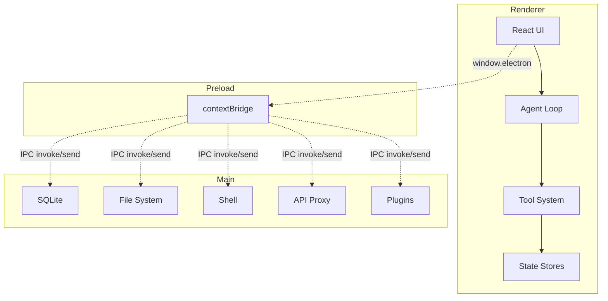

<p align="center">
  <a href="https://github.com/AIDotNet/OpenCowork">
    
  </a>
  <h1 align="center">OpenCowork</h1>
  <p align="center">
    <strong>Open-source desktop platform for multi-agent collaboration</strong><br>
    Run AI agents locally with real tools, parallel teammates, and messaging plugins.
  </p>
  <p align="center">
    <a href="README.zh.md">中文</a> •
    <a href="#project-overview">Overview</a> •
    <a href="#core-capabilities">Capabilities</a> •
    <a href="#architecture-overview">Architecture</a> •
    <a href="#quick-start">Quick Start</a> •
    <a href="#development-guide">Development</a> •
    <a href="#star-history">Star History</a>
  </p>
</p>

<p align="center">
  
  
  
  
  
</p>

---

## Project Overview

OpenCowork is a desktop AI agent collaboration workspace built with Electron, React, and TypeScript. It is designed for local, tool-enabled automation rather than chat-only workflows. Agents can read and write files, run shell commands, search code, schedule tasks, and coordinate with teammates.

Key ideas:

- Local-first execution with explicit approval for risky actions.
- Multi-agent teamwork to split work and run tasks in parallel.
- Plugin-based messaging integrations for workplace chat.

## Core Capabilities

- Multi-agent loop with lead agent orchestration and parallel teammates.
- Tool system for file I/O, shell, search, task tracking, and previews.
- Subagent presets and skill modules loaded from Markdown definitions.
- Messaging plugins for Feishu/Lark, DingTalk, Telegram, Discord, WhatsApp, and WeCom.
- Persistent scheduling with cron or interval-based dispatch.
- MCP integration for external tool servers and resources.
- Local storage with SQLite and user data under `~/.open-cowork/`.

## Architecture Overview

OpenCowork follows a three-process Electron architecture.



## Quick Start

Prerequisites:

- Node.js >= 18
- npm >= 9
- Git

Install and run:

```bash
git clone https://github.com/AIDotNet/OpenCowork.git
cd OpenCowork
npm install
npm run dev
```

Common commands:

```bash
npm run lint
npm run typecheck
npm run build
npm run build:win
npm run build:mac
npm run build:linux
```

## Configuration

1. Open Settings and add your AI provider API key.
2. Select a default model for the app.
3. Enable messaging plugins and configure their tokens if needed.

## Project Structure

```
src/main       Electron main process, IPC, plugins, cron, updater
src/preload    Secure bridge APIs exposed to the renderer
src/renderer   React UI, stores, hooks, and agent logic
resources      Built-in agents and skills packaged with the app
docs           Documentation site (Next.js)
```

User data lives in `~/.open-cowork/` and includes `data.db`, `settings.json`, and `config.json`.

## Development Guide

Add a new tool:

1. Create a ToolHandler in `src/renderer/src/lib/tools/`.
2. Register it in `src/renderer/src/lib/tools/index.ts`.

Add a SubAgent:

1. Create a Markdown definition file with the agent prompt.
2. Place it in `~/.open-cowork/agents/` or `resources/agents/`.

Add a skill:

1. Create a skill directory with `SKILL.md` and optional scripts.
2. Place it in `~/.open-cowork/skills/` or `resources/skills/`.

## Use Cases

- Code review, refactors, and debugging with specialized subagents.
- Project planning, task breakdown, and milestone tracking.
- Data analysis and report generation on local datasets.
- Scheduled reports and message delivery via plugins.

## Star History

[](https://star-history.com/#AIDotNet/OpenCowork&Date)

## Contributing

1. Fork the repository.
2. Create a feature branch.
3. Commit changes with a concise, imperative subject.
4. Open a pull request with summary and verification steps.

## License

Licensed under the [Apache License 2.0](LICENSE).

---

<div align="center">

If this project helps you, please give it a star.

Made by the OpenCowork Team

</div>
