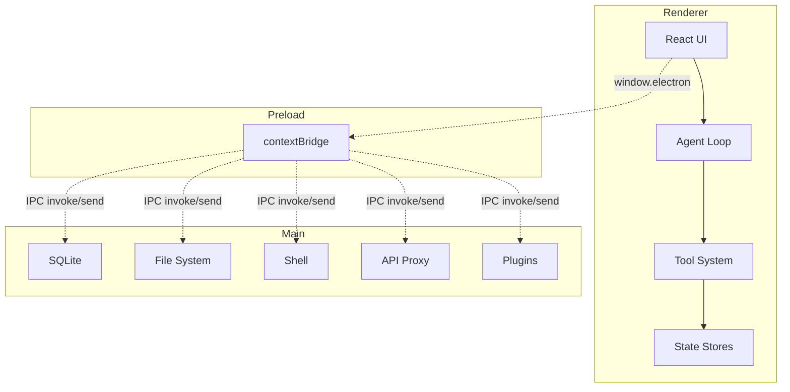

<p align="center">
  <a href="https://github.com/AIDotNet/OpenCowork">
    
  </a>
  <h1 align="center">OpenCowork</h1>
  <p align="center">
    <strong>开源桌面多智能体协作平台</strong><br>
    在本地用真实工具驱动 AI 代理协作与自动化。
  </p>
  <p align="center">
    <a href="README.md">English</a> •
    <a href="#项目概述">概述</a> •
    <a href="#核心能力">能力</a> •
    <a href="#架构概览">架构</a> •
    <a href="#快速开始">快速开始</a> •
    <a href="#开发指南">开发</a> •
    <a href="#star-历史">Star 历史</a>
  </p>
</p>

<p align="center">
  
  
  
  
  
</p>

---

## 项目概述

OpenCowork 是基于 Electron、React、TypeScript 构建的桌面多智能体协作平台，强调本地工具驱动的自动化，而不是单纯聊天。代理可以读写文件、执行 Shell、搜索代码、调度任务，并与队友协作完成复杂工作。

核心理念：

- 本地优先，危险操作需显式审批。
- 多智能体协作，拆分任务并行推进。
- 插件化消息平台集成，落地到真实工作场景。

## 核心能力

- Lead Agent 统筹与并行 Teammate 协作。
- 工具体系覆盖文件、Shell、搜索、任务管理与预览。
- SubAgent 预设与 Skill 模块由 Markdown 定义加载。
- 支持飞书、钉钉、Telegram、Discord、WhatsApp、企业微信等插件接入。
- 支持 cron 与 interval 的持久化调度。
- MCP 接入外部工具与资源。
- 本地 SQLite 存储与 `~/.open-cowork/` 用户数据目录。

## 架构概览

OpenCowork 采用三进程 Electron 架构。



## 快速开始

环境要求：

- Node.js >= 18
- npm >= 9
- Git

安装和运行：

```bash
git clone https://github.com/AIDotNet/OpenCowork.git
cd OpenCowork
npm install
npm run dev
```

常用命令：

```bash
npm run lint
npm run typecheck
npm run build
npm run build:win
npm run build:mac
npm run build:linux
```

## 配置说明

1. 打开设置，添加 AI Provider 的 API Key。
2. 选择默认模型。
3. 按需启用消息平台插件并配置 Token。

## 项目结构

```
src/main       Electron 主进程，IPC、插件、定时任务
src/preload    安全桥接 API
src/renderer   React UI、状态管理与代理逻辑
resources      内置 agents 与 skills
docs           文档站点（Next.js）
```

用户数据目录在 `~/.open-cowork/`，包含 `data.db`、`settings.json`、`config.json`。

## 开发指南

新增工具：

1. 在 `src/renderer/src/lib/tools/` 新建 ToolHandler。
2. 在 `src/renderer/src/lib/tools/index.ts` 注册。

新增 SubAgent：

1. 编写 Markdown 定义文件。
2. 放到 `~/.open-cowork/agents/` 或 `resources/agents/`。

新增 Skill：

1. 创建包含 `SKILL.md` 的技能目录，可选脚本文件。
2. 放到 `~/.open-cowork/skills/` 或 `resources/skills/`。

## 使用场景

- 代码审查、重构与调试。
- 项目规划、任务拆分与进度跟踪。
- 本地数据分析与报告生成。
- 定时报告与消息平台自动推送。

## Star 历史

[](https://star-history.com/#AIDotNet/OpenCowork&Date)

## 贡献指南

1. Fork 仓库。
2. 创建功能分支。
3. 使用简洁的祈使句提交信息。
4. 提交 PR，并写清摘要与验证步骤。

## 许可证

本项目采用 [Apache License 2.0](LICENSE)。

---

<div align="center">

如果这个项目对你有帮助，请点一个 Star。

OpenCowork Team

</div>
