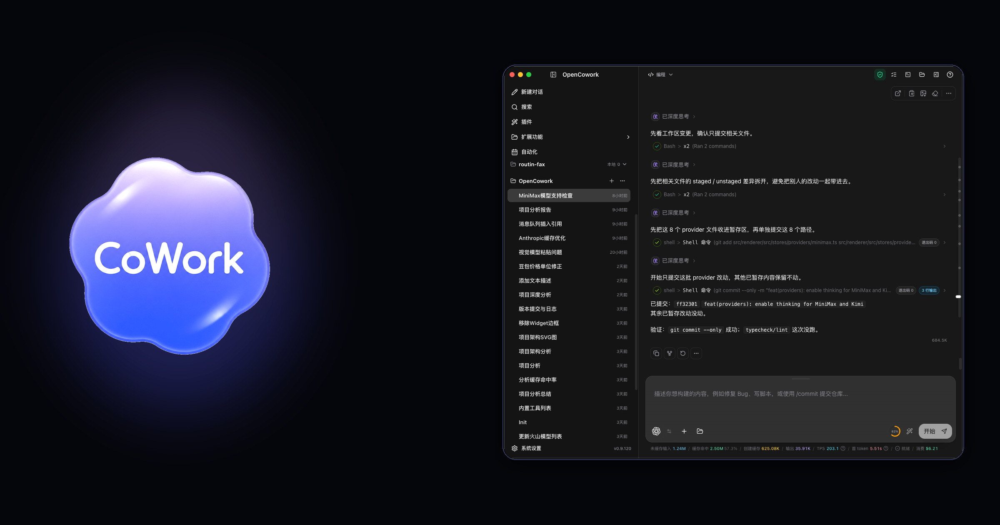
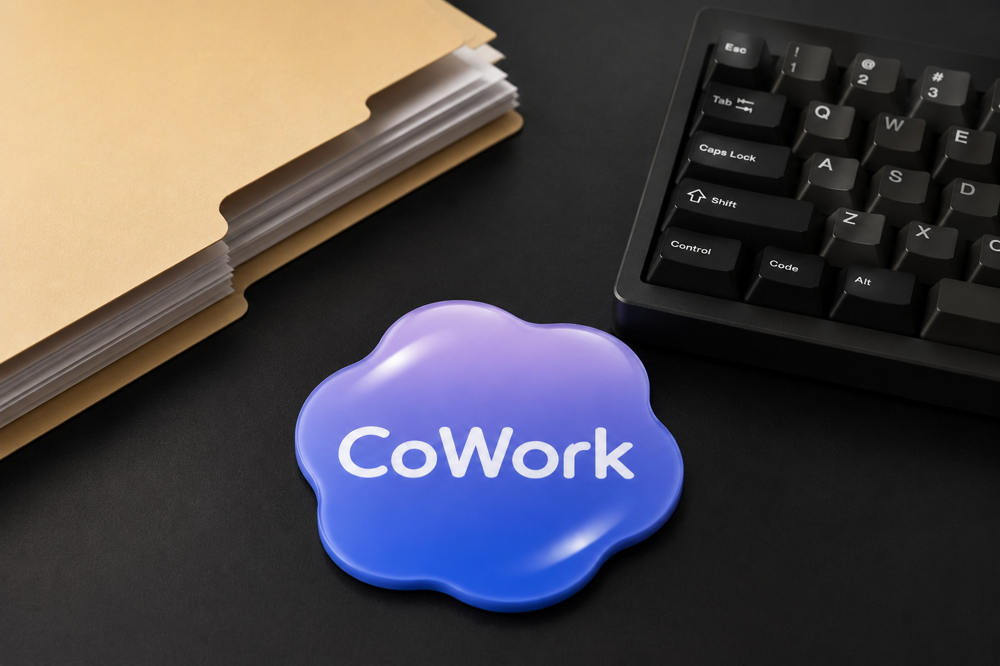
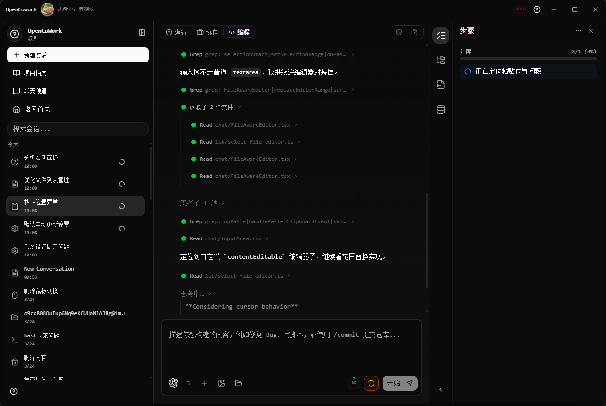
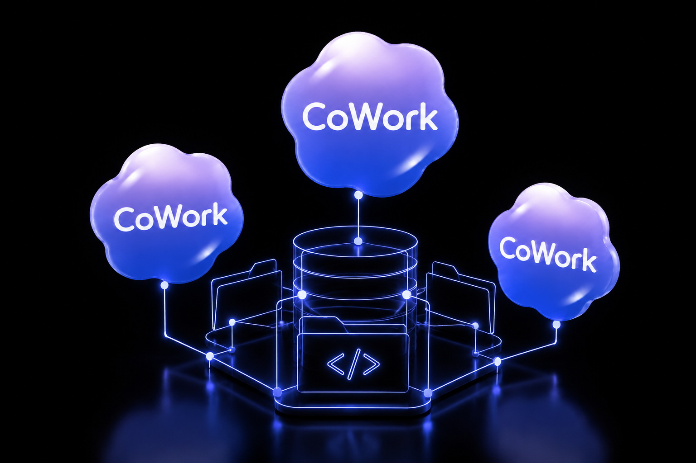
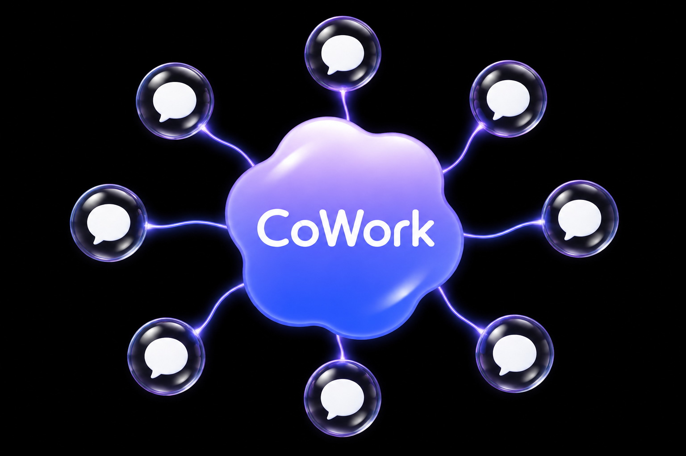
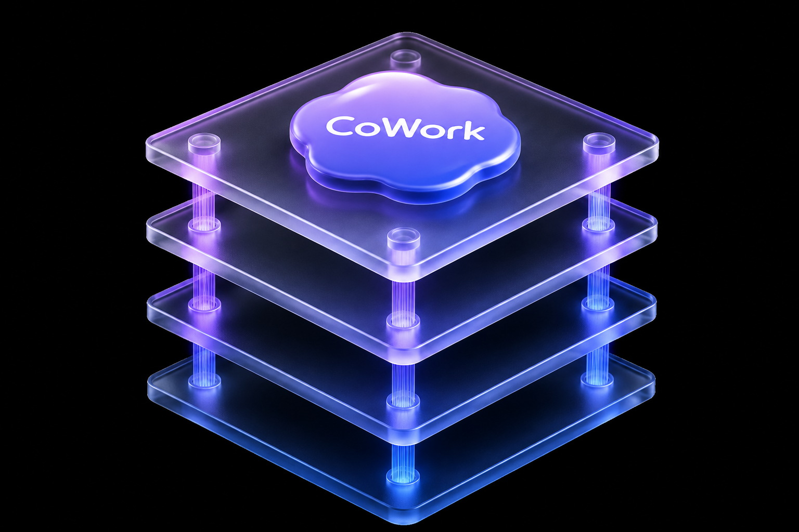
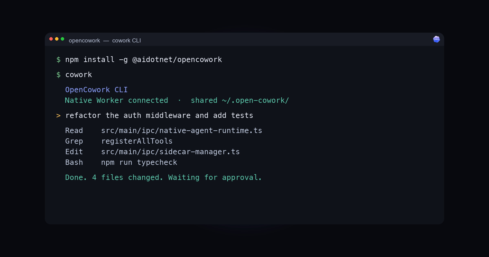

<p align="center">
  <a href="https://github.com/AIDotNet/OpenCowork">
    
  </a>
</p>

<h1 align="center">OpenCowork</h1>

<p align="center">
  <strong>开源桌面多智能体 AI 协作平台</strong><br>
  让智能体直接读你的文件、跑你的 Shell、改你的仓库 —— 全部在你自己的机器上。
</p>

<p align="center">
  <a href="https://github.com/AIDotNet/OpenCowork/releases/latest"></a>
  
  
  <a href="https://github.com/AIDotNet/OpenCowork/stargazers"></a>
</p>

<p align="center">
  <a href="README.md">English</a> ·
  <a href="#为什么选择-opencowork">为什么选择</a> ·
  <a href="#核心特性">核心特性</a> ·
  <a href="#架构">架构</a> ·
  <a href="#快速开始">快速开始</a> ·
  <a href="https://github.com/AIDotNet/OpenCowork/releases/latest">下载</a> ·
  <a href="https://open-cowork.dev">文档</a>
</p>

<p align="center">
  
</p>

---

## 为什么选择 OpenCowork？

大多数 AI 聊天窗口和真实工作环境是隔开的。你把文件拷进去、把日志贴出来，一切上下文都靠手喂。

OpenCowork 把智能体放在**工作旁边**：

- **本地文件与 Shell** — 在你已经打开的项目里读写、编辑、执行命令。
- **智能体自己找上下文** — CodeGraph、搜索和工具自己收集材料，而不是等你粘贴。
- **人在回路** — 工具调用可见，审批始终由你决定。
- **一套运行时，两个界面** — 桌面端和 `cowork` CLI 共用同一个 Native Worker、同一套模型和 `~/.open-cowork/` 数据。

<p align="center">
  
</p>

<p align="center">
  
</p>

---

## 核心特性

<table>
  <tr>
    <td width="50%" valign="top">
      
      <p><strong>天生多智能体。</strong> 子智能体、Agent 团队、Plan 模式、会话目标 —— 不是一个聊天框假装成团队。</p>
    </td>
    <td width="50%" valign="top">
      
      <p><strong>消息在哪，工作就在哪。</strong> 飞书、钉钉、Discord、QQ、Telegram、企业微信、微信公众号、WhatsApp。</p>
    </td>
  </tr>
</table>

### 运行时

- **Electron + .NET Native Worker** — React 19 界面、窄 Preload 桥、Electron 主进程作为宿主网关，加上按平台编译的 **.NET 11 Native AOT** Worker，由它拥有 Agent 循环。
- **Worker 是循环权威** — 模型流式调用、工具执行、审批、取消、SQLite、CodeGraph 索引都在 Worker 内。主进程监管进程；渲染进程负责呈现。
- **SSH** — 通过集成的 xterm.js 终端透明操作远程主机。

### 五种会话模式

| 模式      | 用途 |
| --------- | ---- |
| `chat`    | 快速对话，不使用文件系统或 Shell。 |
| `clarify` | 先问清楚、再产出可审阅计划，然后才写代码。 |
| `cowork`  | 完整 Agent：文件、Shell、浏览器、搜索、子智能体、团队。 |
| `code`    | 结对编程，聚焦编辑，集成 Monaco。 |
| `acp`     | 架构主导：澄清、设计、拆分并委派。 |

### 工具箱

- **文件与 Shell** — Read、Write、Edit、Glob、Grep、Bash（本地和 SSH）。
- **浏览器** — 导航、快照、点击、输入、提取。
- **任务与团队** — TaskCreate / TaskUpdate、并行 `Task` 子智能体、TeamCreate / SendMessage / TeamStatus。
- **Plan 模式** — EnterPlanMode → 写计划 → ExitPlanMode。
- **目标与记忆** — 带 Token 预算的会话目标；分层 `SOUL.md` / `USER.md` / `MEMORY.md`，以及项目级 `.agents/` 覆盖。
- **Cron** — 周期性或一次性后台任务，可投递到通讯渠道。
- **MCP** — stdio、SSE、streamable-HTTP；启用的工具直接暴露给 Agent。
- **技能与扩展** — 技能市场，以及内置扩展（Product Design、Creative Production、HyperFrames、Template Creator 等）。
- **CodeGraph** — Worker 内按需 tree-sitter 索引，提供探索 / 搜索 / 调用方 / 影响面工具。

### 不止聊天

左侧导航是工作台，不只是会话列表：

| 界面           | 作用 |
| -------------- | ---- |
| Task Board     | 智能体与人工工作的看板。 |
| Tasks / Cron   | 定时与一次性 Agent 任务。 |
| Resources      | 项目文件与产物。 |
| Skills / Souls | 领域技能与智能体人格。 |
| Sync           | 通过 WebDAV 同步 `~/.open-cowork/`。 |
| Draw           | 节点图画布，编排图/视频生成。 |
| CodeGraph      | 可视化代码图谱。 |
| SSH            | 独立远程终端窗口。 |

可选的**桌面宠物**（经验、皮肤、离开追踪）和**生命周期 Hooks** 挂在同一套运行时上。

### 国际化

通过 i18next 支持 16 种语言：中文、英文、日语、韩语、法语、德语、西班牙语、葡萄牙语、俄语、阿拉伯语、意大利语、荷兰语、土耳其语、越南语、泰语、印尼语。

---

## 架构

<p align="center">
  
</p>

```
渲染进程 (React 19)  ←→  Preload  ←→  主进程（宿主网关）  ←→  Native Worker (.NET 11 AOT)
     UI、审批呈现、              窗口、IPC、                 Agent 循环、
     会话体验                    通讯插件、MCP、SSH、         工具、SQLite、
                                 Cron、Worker 监管            CodeGraph、任务

CLI (Ink TUI)  ────────────────────────────────────────────→  同一个 Native Worker
```

| 层 | 职责 |
| -- | ---- |
| **渲染进程** | 视图、审批 UI、会话呈现。不是 Agent 循环。 |
| **Preload** | 窄 `contextBridge` API。禁止 `nodeIntegration` 捷径。 |
| **主进程** | 窗口生命周期、Worker 进程、凭据、系统能力、通讯插件、MCP 客户端、Cron 组装、桌面会话落盘。 |
| **Native Worker** | 模型循环、工具目录与执行、审批策略、取消、SQLite、CodeGraph、持久化任务与事件。 |

桌面端和 CLI 是同一个 Worker 的两个客户端。没有第二套 JavaScript Agent 运行时。

目标边界见 [docs/architecture/agent-runtime-boundaries.md](docs/architecture/agent-runtime-boundaries.md)。决策记录见 [docs/adr/0001-agent-runtime-authority.md](docs/adr/0001-agent-runtime-authority.md)。

---

## 终端 CLI

<p align="center">
  
</p>

CLI 是同一 Native Worker 上的终端 UI。它不维护第二份 Provider 凭据，也不实现第二套 Agent 循环。

```bash
npm install -g @aidotnet/opencowork
cowork
```

`opencowork` 是 `cowork` 的别名。凭据、模型、智能体和设置与桌面端共享，都在 `~/.open-cowork/`。

```bash
cowork --doctor
cowork --help
cowork --language zh
```

需要 Node.js ≥ 18。键位、`/model`、Plan 模式和 Worker 覆盖见 [cli/README.md](cli/README.md)。

---

## 快速开始

**从源码跑桌面端：** Node.js ≥ 18，npm ≥ 9，以及 [.NET 11 SDK](https://dotnet.microsoft.com/download/dotnet/11.0) Preview 7 或更高版本所需的 Native AOT 依赖（`dotnet` 在 `PATH` 中）。请带 submodule 克隆 —— 没有 `sidecars/codegraph` 时 Native Worker 无法构建。

```bash
git clone --recurse-submodules https://github.com/AIDotNet/OpenCowork.git
cd OpenCowork
npm install
npm run dev
```

安装包见 [GitHub Releases](https://github.com/AIDotNet/OpenCowork/releases/latest)（Windows 安装包 / 免安装 zip、macOS 13 或更高版本、Linux）。

| 命令                      | 说明 |
| ------------------------- | ---- |
| `npm run dev`             | Electron + Vite 热重载 |
| `npm run build`           | 类型检查后生产构建 |
| `npm run build:win`       | Windows 安装包 |
| `npm run build:win:green` | Windows 免安装 zip |
| `npm run build:mac`       | macOS .dmg / zip |
| `npm run build:linux`     | Linux .AppImage / .deb |
| `npm run lint`            | ESLint |
| `npm run typecheck`       | TypeScript（主进程、渲染进程、CLI） |

数据目录：`~/.open-cowork/` — 数据库、Provider、智能体、技能、命令和提示词。不要提交这个目录。

---

## 使用场景

- **自主编程** — 在你信任的工作区里重构、调试、落地改动。
- **定时运维** — Cron 智能体盯日志或健康状态，汇报到飞书 / 钉钉 / Discord。
- **调研与报告** — 浏览、抓取、处理 CSV/Excel、写出文档。
- **远程操作** — 不用离开应用就能 SSH 上主机。
- **设计与媒体** — Draw 流水线，以及 Product Design / Creative Production / HyperFrames 扩展。

---

## 文档

产品文档：**[open-cowork.dev](https://open-cowork.dev)**。

仓库内指南：[AGENTS.md](AGENTS.md)（约定）、[cli/README.md](cli/README.md)（终端客户端）、[docs/architecture/agent-runtime-boundaries.md](docs/architecture/agent-runtime-boundaries.md)（运行时权威）。

---

## 参与贡献

欢迎贡献。[AGENTS.md](AGENTS.md) 说明了目录结构、编码规范和提交信息格式（`feat(scope): …`）。

提交 PR 前请运行 `npm run typecheck` 和 `npm run lint`。

### 特别感谢

**[RoutinAI](https://routin.ai/)** — 统一大模型 API 网关，覆盖 GPT、Claude、Gemini 及 100+ 其他模型。

**[GeneralUpdate](https://github.com/GeneralLibrary/GeneralUpdate)** — 跨平台 .NET 应用自动更新组件。

## 赞助商

- [lchlfe@hotmail.com](mailto:lchlfe@hotmail.com)
- [caomaohanfengZT](https://github.com/caomaohanfengZT)
- [struggle3](https://github.com/struggle3)

## 许可证

[Apache License 2.0](LICENSE)

---

<p align="center">
  如果 OpenCowork 帮到了你，请给仓库点一颗 Star。<br>
  由 <strong>AIDotNet</strong> 团队打造。
</p>
